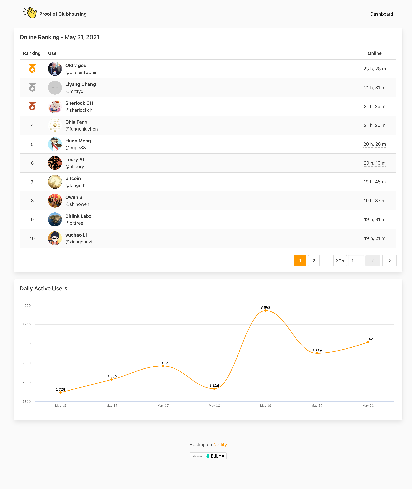

# Proof of Clubhousing

A project that collects user data from a particular Clubhouse channel and displays the data on a dashboard.

## Screenshot



## How It Works

#### `server`

- __Background Jobs__: Utilizes the [unofficial Clubhouse API](https://github.com/Seia-Soto/clubhouse-api/) by seia-soto to aggregate user data every minute and persist it in a database.
- __GraphQL server__: Serves the aggregated data.

#### `dashboard`

- __Dashboard__: Displays *User Rankings* and _Daily Active Users_.

## How to Run

#### `server`

1. Go to the `server` folder
2. Copy `.env-example` and rename it to `.env`
3. Config your _MySQL_ & _Redis_ in `.env`
4. Install the dependencies: `yarn install`

- **Background Jobs** (__Deprecated__ due to the breaking change of the API)
  - Start the background jobs: `yarn start-jobs` 

- **GraphQL Server**
  - Start the GraphQL server: `yarn start`

#### `dashboard`

1. Go to the `dashboard` folder
2. Install the dependencies: `yarn install`
3. Start the dev server: `yarn serve`

## Disclaimer

This project is not affiliated with Clubhouse and is solely for research purposes.

## License

```
MIT License

Copyright (c) 2023 satgi

Permission is hereby granted, free of charge, to any person obtaining a copy
of this software and associated documentation files (the "Software"), to deal
in the Software without restriction, including without limitation the rights
to use, copy, modify, merge, publish, distribute, sublicense, and/or sell
copies of the Software, and to permit persons to whom the Software is
furnished to do so, subject to the following conditions:

The above copyright notice and this permission notice shall be included in all
copies or substantial portions of the Software.

THE SOFTWARE IS PROVIDED "AS IS", WITHOUT WARRANTY OF ANY KIND, EXPRESS OR
IMPLIED, INCLUDING BUT NOT LIMITED TO THE WARRANTIES OF MERCHANTABILITY,
FITNESS FOR A PARTICULAR PURPOSE AND NONINFRINGEMENT. IN NO EVENT SHALL THE
AUTHORS OR COPYRIGHT HOLDERS BE LIABLE FOR ANY CLAIM, DAMAGES OR OTHER
LIABILITY, WHETHER IN AN ACTION OF CONTRACT, TORT OR OTHERWISE, ARISING FROM,
OUT OF OR IN CONNECTION WITH THE SOFTWARE OR THE USE OR OTHER DEALINGS IN THE
SOFTWARE.
```
